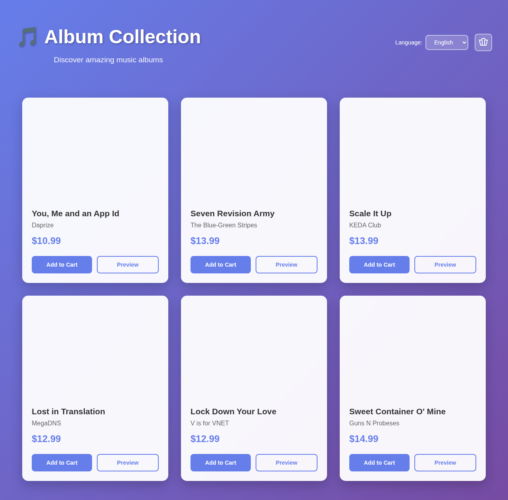
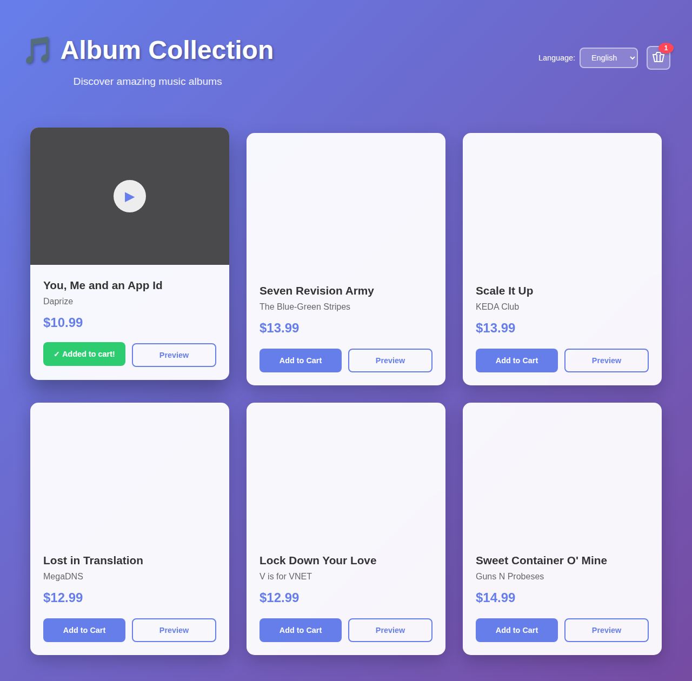
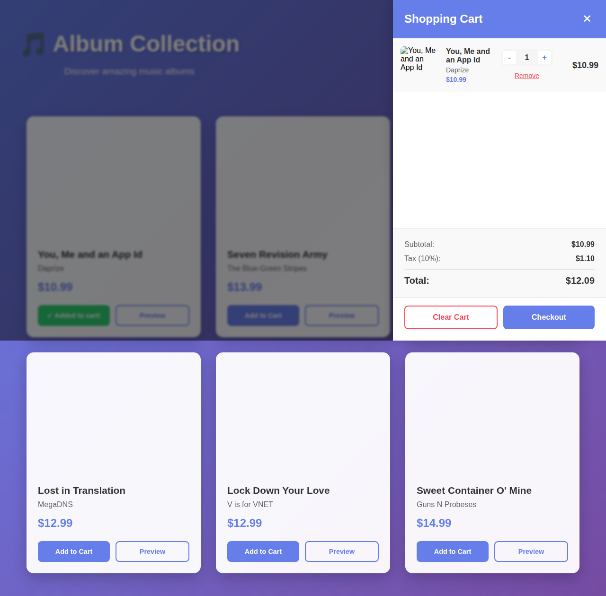
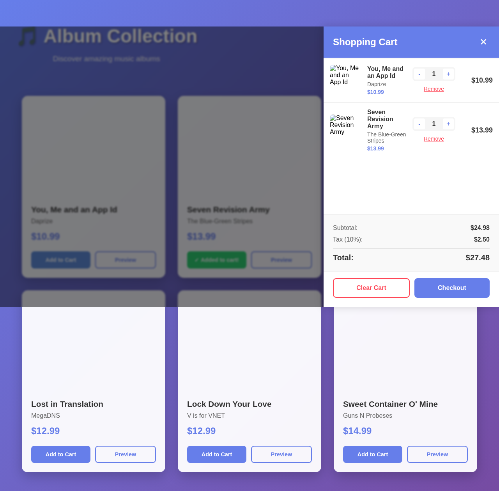
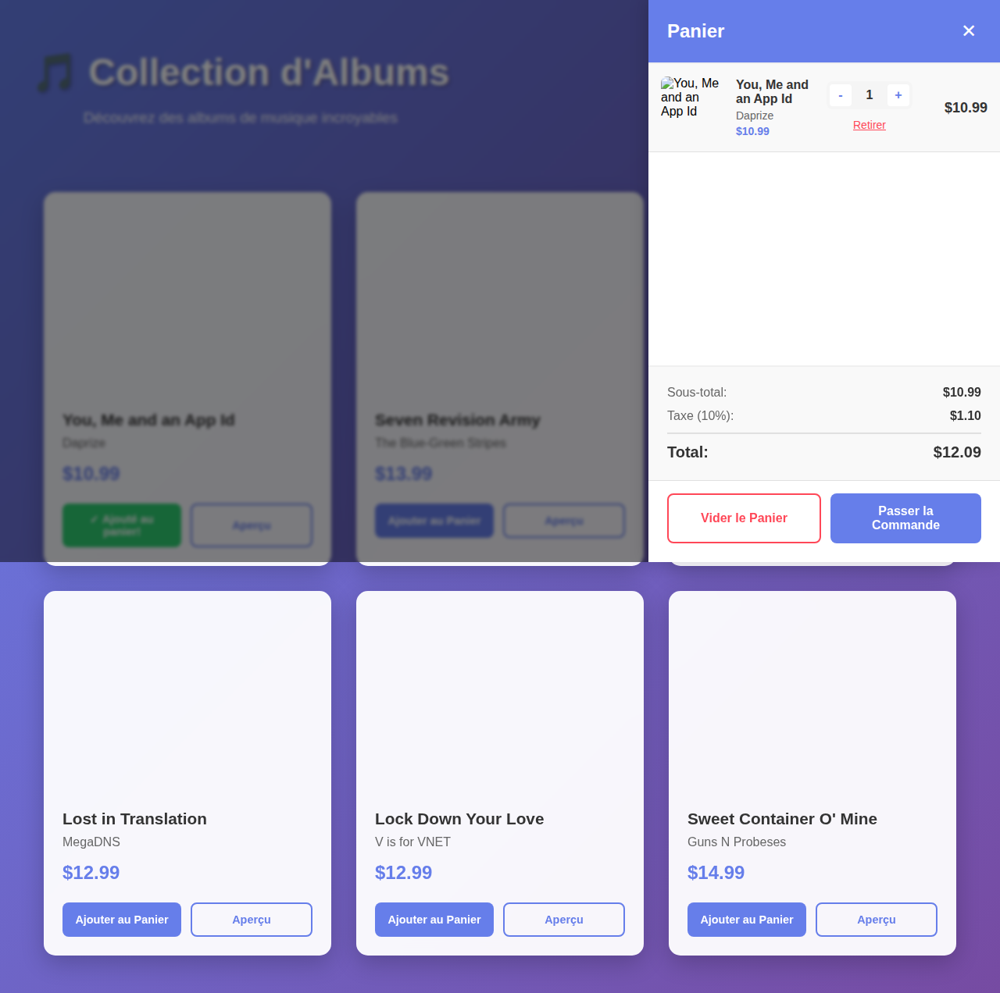
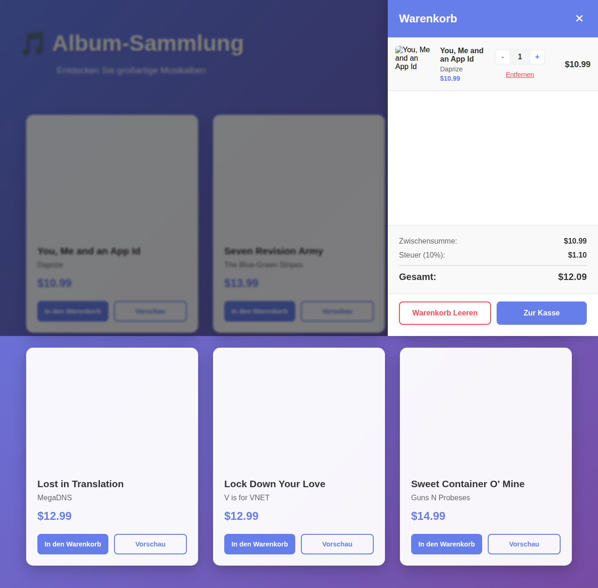
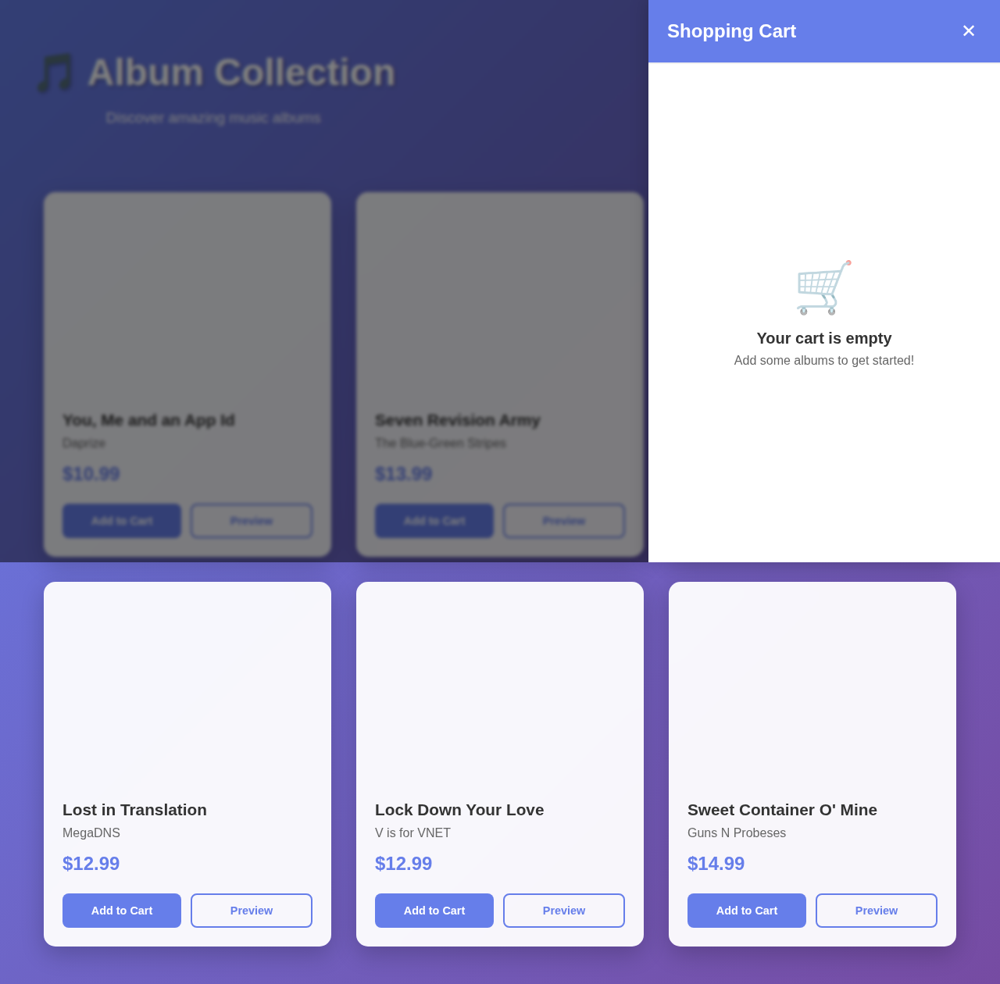

# Shopping Cart Feature - Test Screenshots

This directory contains screenshots captured during Playwright E2E tests demonstrating the shopping cart functionality.

## Screenshots

### 01 - Initial State

- Shows the album viewer with albums grid
- Cart icon visible in header (no badge yet)

### 02 - Item Added

- After clicking "Add to Cart" on first album
- Cart badge shows "1"
- Button shows success feedback

### 03 - Cart Drawer Open

- Cart drawer slides in from right
- Shows single item with details
- Quantity controls and remove button visible

### 04 - Multiple Items

- Two different albums in cart
- Each item displays correctly with image, title, artist, price
- Cart summary shows totals

### 05 - Cart Summary

- Detailed view of cart totals
- Subtotal, tax (10%), and total displayed
- Clear Cart and Checkout buttons

### 06 - French Language

- All UI text translated to French
- Cart title: "Panier"
- Demonstrates i18n support

### 07 - German Language

- All UI text translated to German
- Cart title: "Warenkorb"
- Demonstrates i18n support

### 08 - Empty Cart

- Empty cart state with friendly message
- Shopping cart emoji
- "Your cart is empty" message

## Running the Tests

```bash
# Run all tests
npm test

# Run tests in UI mode
npm run test:ui

# Run tests with specific browser
npx playwright test --project=chromium
```

## Test Coverage

The test suite validates:
- ✅ Cart icon visibility in header
- ✅ Adding items to cart
- ✅ Badge count updates
- ✅ Quantity increment on duplicate adds
- ✅ Cart drawer open/close
- ✅ Multiple items display
- ✅ Quantity controls (increment/decrement)
- ✅ Remove item functionality
- ✅ Clear cart functionality
- ✅ Cart persistence (localStorage)
- ✅ Multi-language support (EN/FR/DE)
- ✅ Empty cart state
- ✅ Cart totals calculation
